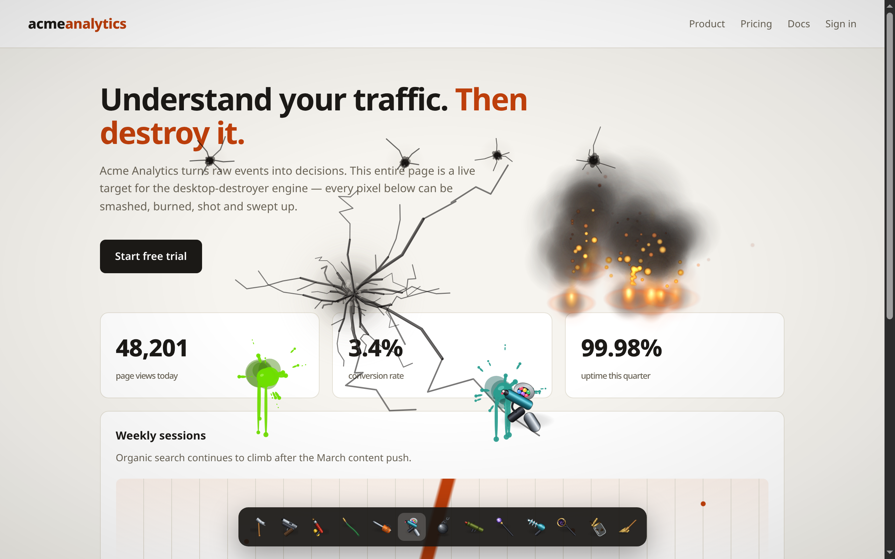

# RageLayer

[](https://www.npmjs.com/package/ragelayer)
[](https://github.com/ParthJadhav/RageLayer/actions/workflows/ci.yml)
[](https://parthjadhav.github.io/RageLayer/api)
[](./LICENSE)

Introducing RageLayer: turn any web page into a destructible canvas. Smash, cut, corrode, burn, explode, undo, and
combine effects across the page—then sweep everything back into place.

[**Try the live demo**](https://parthjadhav.github.io/RageLayer/demo/) ·
[Documentation](https://parthjadhav.github.io/RageLayer/) ·
[Tool gallery](https://parthjadhav.github.io/RageLayer/tools) ·
[API reference](https://parthjadhav.github.io/RageLayer/api)



## Why RageLayer?

- **It destroys the real page.** The DOM is captured into a canvas, so bullets punch holes
  through content and fire burns text and images away.
- **Pieces become physical objects.** Voronoi shards and measured DOM elements tumble, collide,
  and pile up through a built-in rigid-body solver.
- **Fifteen procedural tools.** Seven everyday, five heavy, and three advanced tools—with no model
  assets or network requests, exact icon silhouettes, and configurable scale.
- **Systems that make tools interact.** Four spatial combos, one consistent wood-like physical
  response, bounded undo/redo history, and a typed stateful custom-tool SDK.
- **A real toolbar on every stack.** A complete React component, a complete Vue component, and a
  `<rage-layer>` custom element for everything else — all three rendering one shared,
  framework-neutral toolbar model that you can also use to build your own.
- **Keyboard-driven and translatable.** The toolbar is fully keyboard-operable — roving focus,
  digit shortcuts, undo/redo — and every string, including tool names, can be translated. The
  canvas itself is pointer-only; `engine.strike()` is there if you want to change that.
- **Typed and extensible.** Custom tools are plain TypeScript objects with access to the same
  rendering, physics, fire, and page-damage APIs as the built-ins.
- **Designed to degrade well.** WebGL effects, page capture, audio, and physics fail or disable
  independently; adaptive quality keeps entity counts and rendering cost bounded, honors data
  saver, and suspends work in background tabs.

## Install

```sh
npm install ragelayer
# pnpm add ragelayer
# bun add ragelayer
```

Modern ESM and TypeScript declarations are included. React, React DOM, and Vue are optional peer
dependencies: install only the framework entry you use.

## React / Next.js

The ready-made component mounts the engine, renders an accessible toolbar, handles keyboard
shortcuts, and disposes everything when it unmounts.

```tsx
import { useState } from "react";
import { RageLayer } from "ragelayer/react";

export function DestroyButton() {
  const [open, setOpen] = useState(false);

  return (
    <>
      <button onClick={() => setOpen(true)}>Destroy this page</button>
      {open && <RageLayer onClose={() => setOpen(false)} />}
    </>
  );
}
```

The entry is marked `"use client"`, so it can be imported from a Next.js Client Component. Lazy
load it behind the trigger if you want the normal page visit to pay no engine cost.

For a custom UI, use the headless hook:

```tsx
import { useRageLayer } from "ragelayer/react";

function DestroyButton() {
  const rageLayer = useRageLayer({ initialTool: "flamethrower" });
  return <button onClick={rageLayer.toggle}>{rageLayer.isOpen ? "Repair" : "Destroy"}</button>;
}
```

## Vue / Nuxt

The Vue component is the same ready-made toolbar as the React one:

```vue
<script setup lang="ts">
import { ref } from "vue";
import { RageLayer } from "ragelayer/vue";

const open = ref(false);
</script>

<template>
  <button @click="open = true">Destroy this page</button>
  <RageLayer v-if="open" @close="open = false" />
</template>
```

It renders nothing until it is mounted in a browser, so it is safe in a Nuxt page without
`<ClientOnly>`. For a custom UI, use the headless composable, which closes the engine with its Vue
effect scope:

```vue
<script setup lang="ts">
import { useRageLayer } from "ragelayer/vue";

const { isOpen, toggle } = useRageLayer({ initialTool: "hammer" });
</script>

<template>
  <button @click="toggle">{{ isOpen ? "Repair" : "Destroy this page" }}</button>
</template>
```

## Svelte, Angular, Solid, Astro — and plain HTML

The custom element is a complete toolbar that needs no framework wrapper:

```html
<script type="module">
  import "ragelayer/element";
</script>

<rage-layer initial-tool="hammer"></rage-layer>
```

It builds its UI in a shadow root, emits `ragelayer-close` when the visitor closes it, and disposes the
engine when the element leaves the document.

### Svelte's own action

To wire your own launcher instead:

```svelte
<script lang="ts">
  import { rageLayer } from "ragelayer/svelte";
</script>

<button use:rageLayer={{ initialTool: "hammer" }}>Destroy this page</button>
```

It toggles on repeated clicks, maintains `aria-pressed`, and closes automatically when the button
is destroyed.

## Vanilla JS and every other framework

The lazy controller does no browser work until `open()`, which makes it safe to create during SSR:

```ts
import { createRageLayer } from "ragelayer";

const rageLayer = createRageLayer({ initialTool: "hammer" });

document.querySelector("#destroy")?.addEventListener("click", () => rageLayer.toggle());
window.addEventListener("pagehide", () => rageLayer.close());
```

If you already own the lifecycle, mount the engine directly:

```ts
import { mountRageLayer } from "ragelayer";

const engine = mountRageLayer({ initialTool: "blackhole", soundEnabled: true });
engine.clear();
engine.dispose();
```

| Stack | Supported API | Package entry |
| --- | --- | --- |
| React 18/19, Next.js | Component + headless hook | `ragelayer/react` |
| Vue 3, Nuxt | Component + composable | `ragelayer/vue` |
| Svelte, SvelteKit | Custom element + action | `ragelayer/element`, `/svelte` |
| Astro, Angular, Solid, Qwik | Custom element or controller | `ragelayer/element` |
| Plain JavaScript / TypeScript | Controller or direct engine | `ragelayer` |
| Your own toolbar UI | Headless toolbar model | `ragelayer/toolbar` |

See the [integration guide](./docs/integrations.md) for SSR, cleanup and custom toolbars, and
[`examples/`](./examples) for runnable Next.js, Nuxt, SvelteKit and no-framework starters.

## Custom tools

A tool is a small object. Persistent marks go on `surfaceCtx`; transient effects go on `fxCtx`.

```ts
import type { Tool } from "ragelayer";

export const stamp: Tool = {
  id: "stamp",
  name: "Stamp",
  icon: "🐾",
  hint: "click to stamp",
  onDown(engine, event) {
    engine.surfaceCtx.fillText("🐾", event.x, event.y);
    engine.shake(3);
  },
};
```

Pass custom tools through `tools` on any helper or framework adapter. The full contract is in the
[custom tools guide](./docs/api.md#custom-tools).

For isolated state, rate-limited effects, and exact custom icon bounds, use `defineTool()` from
`ragelayer/sdk`. See the [advanced systems guide](./docs/advanced.md).

## Package entry points

| Import | Exports |
| --- | --- |
| `ragelayer` | Engine, lifecycle helpers, built-in tools, types, and low-level primitives |
| `ragelayer/engine` | Engine and public contracts without built-in tool models |
| `ragelayer/tools` | Seven everyday tools: Hammer, Gun, Flamethrower, Water Hose, Chainsaw, Paintball, and Broom |
| `ragelayer/tools/heavy` | Five heavy tools: Demolition, Rocket Launcher, Lightning, Black Hole, and Bugs |
| `ragelayer/tools/advanced` | Three advanced tools: Laser Cutter, Acid Jar, and Sticky Bombs |
| `ragelayer/lazy` | On-demand loaders for base, heavy, or complete toolsets |
| `ragelayer/sdk` | Typed custom-tool factories, rate limiter, and icon metadata |
| `ragelayer/react` | `RageLayer`, `useRageLayer` |
| `ragelayer/vue` | `RageLayer`, `useRageLayer` |
| `ragelayer/svelte` | `rageLayer`, `createRageLayer` |
| `ragelayer/element` | `<rage-layer>`, the toolbar for every other stack |
| `ragelayer/toolbar` | `ToolbarModel`, `DEFAULT_STRINGS` — build your own toolbar |

The package is ESM-only, tree-shakeable, and has zero runtime dependencies — the `html-to-image`
capture code ships inside the package as its own chunk that is loaded only when snapshot capture
runs, so `dist` also works loaded directly in a browser without a bundler.

For the smallest deliberate setup, combine the engine-only and base-tool entries:

```ts
import { RageLayerEngine } from "ragelayer/engine";
import { baseTools } from "ragelayer/tools";

const engine = new RageLayerEngine({ toolScale: 1.15 });
engine.registerTools(baseTools);
engine.setTool("hammer");
```

Later, `loadHeavyTools()` from `ragelayer/lazy` can unlock the cinematic tools without
putting them in the initial graph. See [procedural 3D models](./docs/models.md).

## Browser support

RageLayer targets current evergreen browsers and requires Canvas 2D. Chrome is covered by
the runtime smoke suite. WebGL/WebGL2, WebAudio, and experimental live capture are enhancements;
the engine falls back without them. Construct or open an engine only in the browser.

Page capture inherits normal browser security rules. Cross-origin images without CORS permission
may prevent a complete snapshot; the engine then keeps the real page visible and uses overlay-only
damage. See [capture and framework integration notes](./docs/integrations.md).

## Documentation

- [Getting started](./docs/getting-started.md)
- [Framework integrations](./docs/integrations.md)
- [API reference](./docs/api.md)
- [Tool gallery](./docs/tools.md)
- [Toolbars, translation and keyboard use](./docs/toolbar.md)
- [Procedural 3D models and loading](./docs/models.md)
- [Combos, history, toolsets, and SDK](./docs/advanced.md)
- [Architecture](./docs/architecture.md)
- [Performance and benchmarks](./docs/performance.md)
- [Compatibility](./docs/compatibility.md)
- [Accessibility](./docs/accessibility.md)
- [Troubleshooting](./docs/troubleshooting.md)
- [Versioning and API stability](./docs/versioning.md)
- [Contributing](./CONTRIBUTING.md)
- [Maintainer guide](./MAINTAINERS.md)
- [Security policy](./SECURITY.md)

## Development

```sh
bun install
bun run check         # types, lint, unit tests + coverage floors, build, package validation
bun run test:browser  # runtime suite in headless Chrome (real WebGL, real capture)
bun run demo:tools    # record all 15 tools as a video reel for review
bun run benchmark:low-end # fixed workloads with 6× CPU throttling
bun run docs:dev      # local documentation site
bun run docs:build    # production docs + live demo
```

`test:browser` needs a Chrome binary; point `RAGELAYER_CHROME_PATH` at one if it is not on the default
path. It is the only place page capture, the WebGL2 surface shader and the post-processing chain
actually execute, so run it before changing any of them.
`demo:tools` writes clips, stills and an `index.html` to the ignored `artifacts/tool-demo/`
directory for local review only. Generated reels and stills are never uploaded or published.
Profiler flags and a controlled comparison workflow are
documented in [Performance and benchmarks](./docs/performance.md).

Changes are released with Changesets. Read [CONTRIBUTING.md](./CONTRIBUTING.md) before opening a
pull request.

## Credits

Inspired by the classic Windows Desktop Destroyer toy and by
[canvasui.dev](https://canvasui.dev)'s HTML-in-canvas work.

## License

[MIT](./LICENSE) © Parth Jadhav
