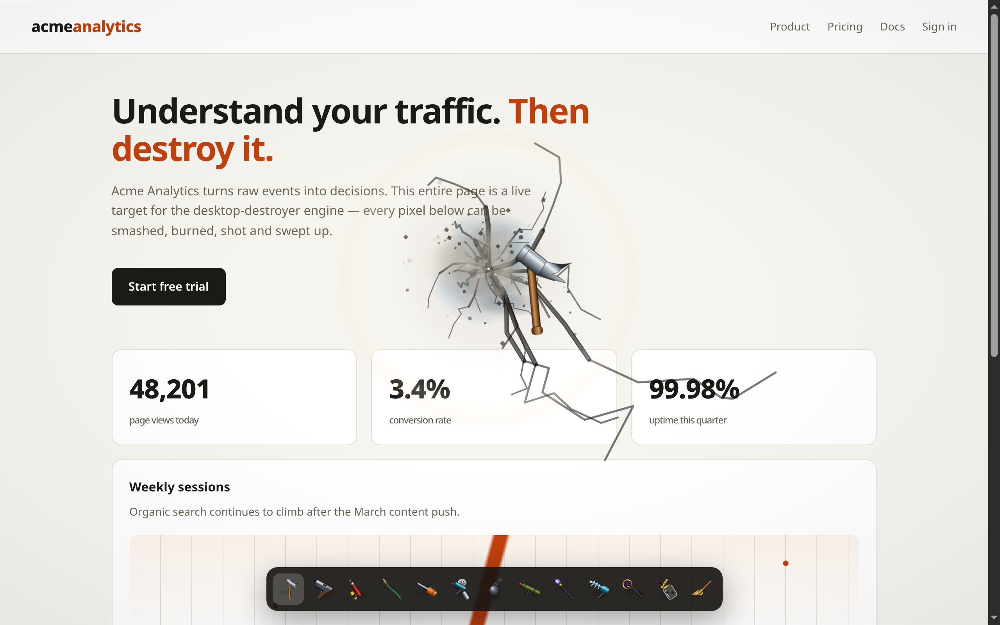

# Tool gallery

Every screenshot below is generated from the current build by
[`scripts/screenshots.mjs`](../scripts/screenshots.mjs), which drives the
[demo page](../demo/index.html) with real pointer input in headless Chrome.
Regenerate them any time with `bun run screenshots`.

## The demo page, pristine

The engine is open (toolbar at the bottom) but nothing has been destroyed yet — an undamaged
page is bit-identical to the raster.

## Hammer

Each spot takes escalating blows — dent, spreading cracks, deep splintering — then fractures
into rigid-body debris that tumbles and piles up.

## Gun

Held trigger goes full-auto: aimed spray, transparent holes punched through the real content,
casings and barrel smoke.

## Flamethrower

Fire catches, burns, deepens, then breaks through to the void. It spreads on its own fuel
field and keeps eating the page after you release.

## Chainsaw

Tears gashes and strips — close a loop and the enclosed piece drops out whole, carrying its
slice of the page with it.

## Paintball

Splatters that drip and dry, clipped to surviving page pixels.

## Black hole

Held: thin-lens gravitational deflection, frame-dragging swirl, photon ring, opaque horizon.
It rips elements loose and pulls debris in on an inverse-square law, then detonates on release.

## Lightning

A forking bolt with sub-branches and restrike flicker, an ionized burn channel, ground
crawlers, a crater, and fires.

## Freeze ray + hammer: frost shatter

A frozen patch doesn't tear like paper — it comes apart like glass: more, lighter,
blue-tinted shards with a crystalline glint twinkling over the break for an instant.

## A mixed session

Gun, hammer, flamethrower and paintball together — smoke plumes, live fires, crack webs,
splats, and the debris heap at the bottom of the window.

