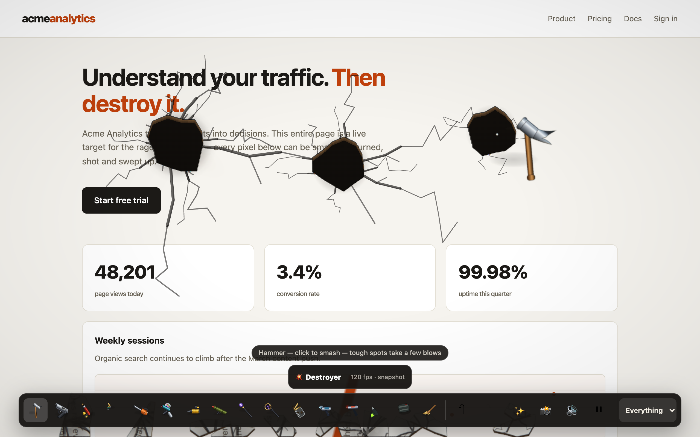
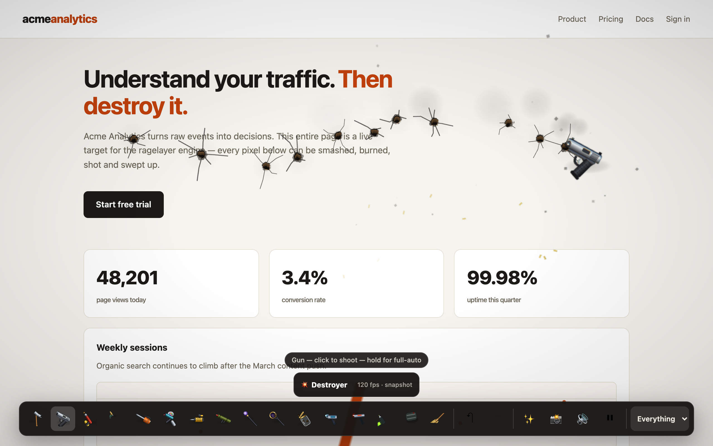
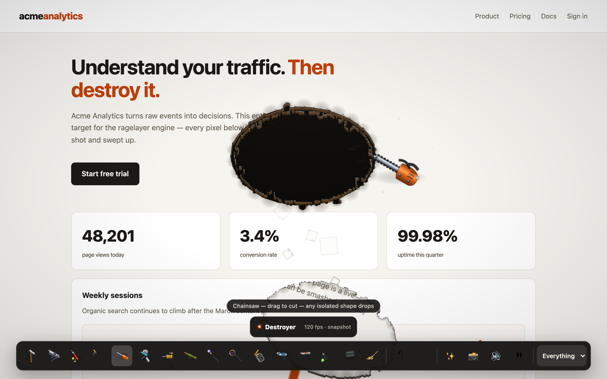
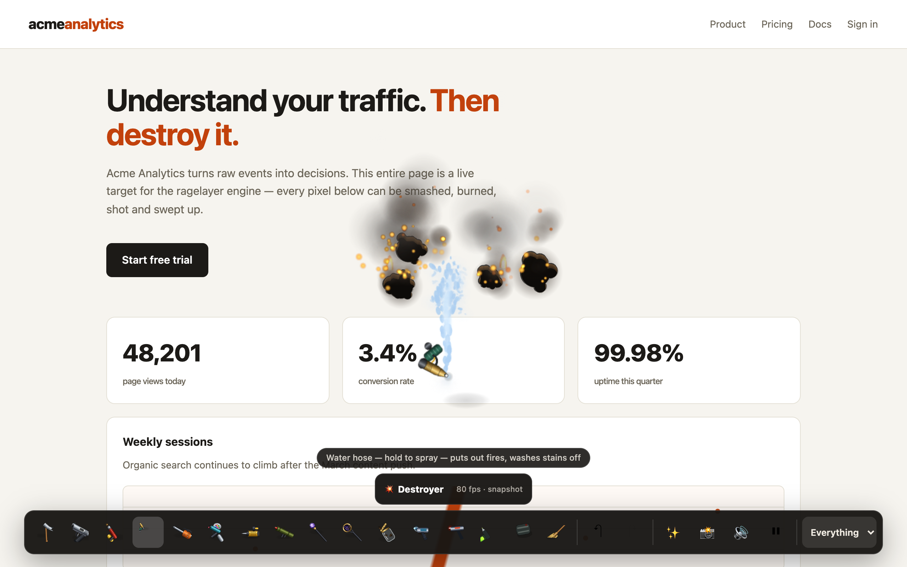
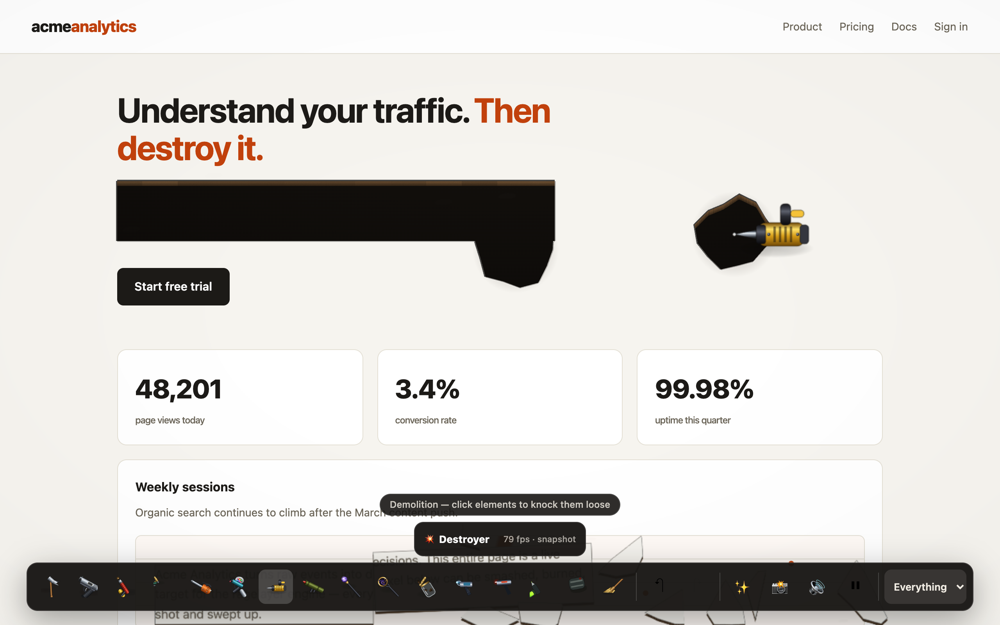
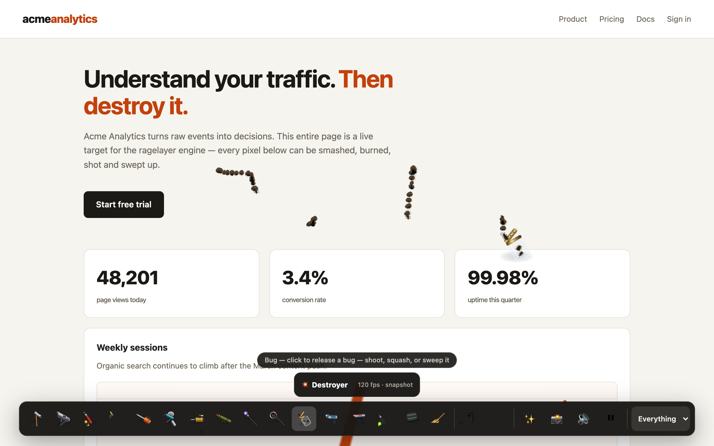

# Tool gallery

Every screenshot below is generated from the current build by
[`scripts/screenshots.mjs`](../scripts/screenshots.mjs), which drives the
[demo page](./demo/) with real pointer input in headless Chrome.
Regenerate them any time with `bun run screenshots`.

RageLayer ships 16 built-in tools in three entry-point groups:

| Group | Count | Tools |
|---|---:|---|
| Base | 7 | Hammer, Gun, Flamethrower, Water Hose, Chainsaw, Paintball, Broom |
| Heavy | 5 | Demolition, Rocket Launcher, Lightning, Black Hole, Bugs |
| Advanced | 4 | Gravity Gun, Laser Cutter, Acid Sprayer, Sticky Bombs |

## The demo page, pristine

The engine is open (toolbar at the bottom) but nothing has been destroyed yet — an undamaged
page is bit-identical to the raster.

## Hammer

Each spot takes escalating blows — dent, spreading cracks, deep splintering — then fractures
into rigid-body debris that tumbles and piles up.

## Gun

A click fires one aimed round; hold briefly for full-auto spray, transparent holes through the real
content, ejected casings, and barrel smoke. The procedural pistol has a detailed frame, open trigger
guard, working slide, and recoil timed to the firing cadence.

## Flamethrower

Fire catches, burns, deepens, then breaks through to the void. It spreads on its own fuel
field and keeps eating the page after you release.

## Chainsaw

Tears gashes and strips — close a loop and the enclosed piece drops out whole, carrying its
slice of the page with it.

## Paintball

Click for one splat or hold for automatic paintball fire. Every hit drips and dries, clipped to
surviving page pixels.

## Water hose

The compact pistol-grip pressure nozzle sprays a tight ballistic stream that breaks into droplets,
puts out fires it reaches, and rinses paint and soot off surviving pixels. Washing cleans stains but
does not repair structure, so a hole stays a hole.

## Broom

Drag to sweep. The only genuinely restorative tool: it repairs the page back to the pristine
capture under the bristles, and swats any bugs it passes over. Sweeping intact page leaves it
exactly intact, with no seam where the sweep passed.

## Black hole

Held: thin-lens gravitational deflection, frame-dragging swirl, photon ring, opaque horizon.
It rips elements loose and hauls debris in on an inverse-linear pull with a capture funnel at the horizon, then detonates on release.

## Lightning

A forking bolt with sub-branches and restrike flicker, an ionized burn channel, ground
crawlers, a crater, and fires.

## Rocket launcher

Click to launch. The rocket leaves the muzzle along the tool's aim with a backblast and recoil,
arms only once it has actually flown, then detonates on impact — so the crater is never where the
click was.

## Demolition

Click page furniture — cards, images, paragraphs — to knock the whole element loose as a single
rigid body rather than fracturing it. Elements are measured from the live layout at capture time,
so what you can see is what you can pull out.

## Bugs

Click to release a bug. They crawl over the surviving page, avoid the void, and can be squashed
with any impact tool, shot, or swept up with the broom.

## Gravity gun

Hold over wreckage to pull rigid chunks into orbit, then release to launch the nearest piece along
the tool's aim. Using it around a sticky-bomb blast triggers the orbital-bomb combo.

## Laser cutter

Drag for a straight, constant-width heated kerf. Like the chainsaw, the laser removes structure
along its entire path and drops any isolated piece as rigid debris; its edge stays clean instead of
chattering like a saw cut.

## Acid sprayer

Hold to spray along the direction of the drawn nozzle. The visible droplets, stains, and structural
corrosion share the same impact points, then each deposit creeps a short, bounded distance nearby.
Acid meeting fire causes a volatile-corrosion blast.

## Sticky bombs

Click to attach up to eight timed charges. Charges remain visible on the surface, spark near the
end of their fuse, then fracture and ignite the attachment point.

## Physical behavior and combos

All captured content uses the same built-in wood-like physical response, so tool strength and
timing are predictable across a page. Nearby effects can still combine; see the
[advanced systems guide](./advanced.md) for the four built-in combos.

## A mixed session

Gun, hammer, flamethrower and paintball together — smoke plumes, live fires, crack webs,
splats, and the debris heap at the bottom of the window.

